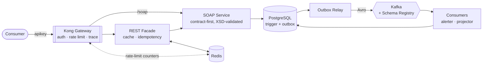

# Integration & API Platform

An enterprise integration stack built as **one coherent system**: a contract-first
SOAP service, a REST facade with Redis, a Kong API gateway, and Kafka event
streaming with schema governance — all over a real PostgreSQL inventory domain.

**Skills:** SOAP · XML Schema (XSD) · service contracts & versioning · Redis ·
Kong API Gateway · Kafka · Avro · Schema Registry · transactional outbox · CQRS

---

## Architecture



A single write travels: **Kong → REST → SOAP → Postgres trigger → outbox →
relay → Kafka → consumers → read model.**

| Phase | Focus | Status |
|---|---|---|
| [1 — SOAP service](phase1-soap-service/) | SOAP, XSD, service contracts | ✅ Working |
| [2 — REST facade](phase2-rest-facade/) | Redis caching, rate limiting, strangler fig | ✅ Working |
| [3 — API gateway](phase3-gateway/) | Kong: auth, rate limiting, tracing | ✅ Working |
| [4 — Events](phase4-events/) | Kafka, Avro, Schema Registry, outbox | ✅ Working |

Full plan and exercises: **[ROADMAP.md](ROADMAP.md)**

---

## Quick start

**Prerequisites:** Java 21, Docker, and PostgreSQL with the `inventory_mgmt`
database from the [companion SQL project](https://github.com/jdoan5/Databases-and-Data-Platforms).

```bash
docker compose up -d redis kong kafka schema-registry
```

Apply the Phase 4 schema additions:

```bash
psql -d inventory_mgmt -f phase4-events/sql/01_outbox.sql -f phase4-events/sql/02_read_model.sql
```

Start the three services, each in its own terminal:

```bash
cd phase1-soap-service && ./mvnw spring-boot:run
```

```bash
cd phase2-rest-facade && ./mvnw spring-boot:run
```

```bash
cd phase4-events/app && ./mvnw spring-boot:run
```

Verify the whole chain:

```bash
./phase3-gateway/test-gateway.sh
```

| Port | Service |
|---|---|
| 8000 / 8001 | Kong proxy / admin |
| 8081 | SOAP service |
| 8082 | REST facade |
| 8083 | Events (outbox relay + consumers) |
| 9092 / 8085 | Kafka / Schema Registry |
| 6379 / 5432 | Redis / PostgreSQL |

Configuration is entirely environment-driven with working local defaults — see
[`.env.example`](.env.example). No `.env` is needed for local development.

> The API keys in [`kong.yml`](phase3-gateway/kong.yml) are **local demo
> credentials**, committed on purpose so the project runs with one command. They
> grant access to nothing but a laptop. Real deployments use vault references.

---

## The four phases

### [1 — Contract-first SOAP](phase1-soap-service/)

The XSD is hand-written **first**; JAXB generates the Java classes and Spring-WS
generates the WSDL. There is no `if (!sku.matches(...))` anywhere — the
`PayloadValidatingInterceptor` enforces the schema at the boundary, and those
constraints are published to consumers inside the WSDL.

Faults are schema-defined too, so consumers branch on a stable `code` rather than
string-matching English prose.

### [2 — REST facade + Redis](phase2-rest-facade/)

The **strangler fig**: new consumers get JSON while the SOAP contract keeps
serving existing integrations. Cache-aside with differentiated TTLs (products
5 min, stock 30 s), explicit invalidation on write, a Lua-scripted rate limiter,
and `Idempotency-Key` support so a client retry cannot double-count stock.

The cache is an optimisation, not a dependency — with Redis stopped, reads still
return 200 and writes still return 201.

### [3 — Kong gateway](phase3-gateway/)

Everything Kong knows lives in one reviewable [`kong.yml`](phase3-gateway/kong.yml):
services, routes, plugins, consumers, credentials. DB-less and declarative — no
admin-UI clicking, no config drift.

Authentication moved out of application code entirely. The SOAP route
deliberately has **no** API key: legacy consumers get throttling and
observability now, authentication after they migrate.

### [4 — Kafka events](phase4-events/)

Events are published via the **transactional outbox**, not a dual write. The
movement and its event commit in one database transaction; a relay publishes
them afterwards. Delivery is **at-least-once**, and both consumers deduplicate —
verified by replaying every event and confirming the read model was unchanged.

The [schema evolution demo](phase4-events/schema-evolution-demo.sh) is the most
valuable exercise here: the registry accepts an optional field with a default,
**rejects** a required field without one, and — surprisingly — accepts *removing*
a required field under `BACKWARD`.

---

## What this project is really about

Both Phase 1 and Phase 4 are contract-first. The XSD and the Avro schema are both
hand-written, both generate code. The difference is that only one has a
**referee**:

| XSD | Avro + Schema Registry |
|---|---|
| Contract lives in your repo | Contract lives in a shared registry |
| Validates one **message** | Validates the **schema change itself** |
| Nothing stops a breaking edit | Registry **refuses** incompatible changes |
| Consumers find out in production | Producer finds out at deploy time |

Understanding *that* — and why `BACKWARD` and `FORWARD` answer different
questions — is the point of building all four phases rather than one.

---

## Notes on the commit history

The history includes real bugs found by running the system, not just reading
about it:

- **Postgres cannot infer a parameter's type inside an `IS NULL` test** — optional
  filter queries failed with a message that never mentions `IS NULL`.
- **A distributed trace that silently died** at the REST facade. Kong generated a
  correlation ID and the facade dropped it; "one trace across every hop" was
  documented but untrue until it was tested.
- **A cache that had become a hard dependency** — every read returned 500 when
  Redis went down.
- **`"X-Gateway: kong"` producing the value `" kong"`** — Kong keeps everything
  after the colon, whitespace included, and a presence-only assertion missed it.

Each is documented as a gotcha in the relevant phase README.

## Related

- [Databases-and-Data-Platforms](https://github.com/jdoan5/Databases-and-Data-Platforms) —
  the PostgreSQL inventory schema, views, and triggers this platform runs on.

## License

[MIT](LICENSE)
