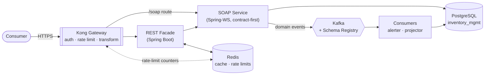

# Integration & API Platform

Enterprise integration patterns built as one coherent system: a contract-first
SOAP service, a REST facade with Redis, a Kong API gateway, and Kafka event
streaming — all over the inventory domain from
[Databases-and-Data-Platforms](https://github.com/jdoan5/Databases-and-Data-Platforms).

**Skills demonstrated:** SOAP · XML Schema (XSD) · service contracts & versioning ·
Redis · Kong API Gateway · Kafka · schema evolution

## Architecture



## Phases

| Phase | Focus | Status |
|---|---|---|
| [1 — SOAP service](phase1-soap-service/) | SOAP, XSD, service contracts | ✅ Working |
| [2 — REST facade](phase2-rest-facade/) | Redis caching, rate limiting, strangler-fig migration | ✅ Working |
| 3 — API gateway | Kong: auth, rate limiting, transformation | Planned |
| 4 — Events | Kafka, Schema Registry, schema evolution | Planned |

Full plan and exercises: **[ROADMAP.md](ROADMAP.md)**

## Quick start

Needs PostgreSQL (Postgres.app) with the `inventory_mgmt` database, plus Redis:

```bash
docker compose up -d redis
```

Then start Phase 1 (SOAP, port 8081) and Phase 2 (REST, port 8082):

```bash
cd phase1-soap-service && JAVA_HOME=$(/usr/libexec/java_home -v 21) ./mvnw spring-boot:run
```

Then fetch the generated WSDL:

```bash
curl -s http://localhost:8081/ws/inventory.wsdl | xmllint --format - | head -40
```

## Why one project

SOAP + XSD + service contracts + a gateway + Kafka + Redis is the standard toolkit
for modernizing a legacy integration layer. Demonstrating them as one system —
rather than six disconnected demos — shows the integration thinking that the work
actually requires.
