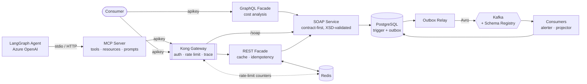

# Integration & API Platform

An enterprise integration stack built as **one coherent system**: a contract-first
SOAP service, a REST facade with Redis, a Kong API gateway, and Kafka event
streaming with schema governance — all over a real PostgreSQL inventory domain.

**Skills:** SOAP · XML Schema (XSD) · service contracts & versioning · Redis ·
Kong API Gateway · Kafka · Avro · Schema Registry · transactional outbox · CQRS ·
MCP · LangGraph · Azure OpenAI · GraphQL · OpenTelemetry · Temporal

---

## Architecture



A single write travels: **Kong → REST → SOAP → Postgres trigger → outbox →
relay → Kafka → consumers → read model.**

| Phase | Focus | Status |
|---|---|---|
| [1 — SOAP service](phase1-soap-service/) | SOAP, XSD, service contracts | ✅ Working |
| [2 — REST facade](phase2-rest-facade/) | Redis caching, rate limiting, strangler fig | ✅ Working |
| [3 — API gateway](phase3-gateway/) | Kong: auth, rate limiting, tracing | ✅ Working |
| [4 — Events](phase4-events/) | Kafka, Avro, Schema Registry, outbox | ✅ Working |
| [5 — MCP & agent](phase5-mcp-agent/) | MCP, LangGraph, Azure OpenAI | ✅ Working |
| [6 — GraphQL](phase6-graphql/) | GraphQL, query cost analysis, batching | ✅ Working |
| [7 — Tracing](phase7-observability/) | OpenTelemetry, Jaeger, context propagation | ✅ Working |
| [8 — Orchestration](phase8-orchestration/) | Temporal, sagas, compensation, durable signals | ✅ Working |

**Try the GraphQL layer without installing anything:** [live GraphiQL](https://inventory-graphql-demo-ihnb3flw5a-uc.a.run.app/graphiql?path=/graphql) — a read-only build of Phase 6 with a
snapshot of the inventory data. Same schema, same cost analysis, no database.

Full plan and exercises: **[ROADMAP.md](ROADMAP.md)**

---

## Quick start

**Prerequisites:** Java 21, Docker, and PostgreSQL with the `inventory_mgmt`
database from the [companion SQL project](https://github.com/jdoan5/Databases-and-Data-Platforms).

```bash
docker compose up -d redis kong kafka schema-registry
```

Apply the Phase 4 schema additions:

```bash
psql -d inventory_mgmt -f phase4-events/sql/01_outbox.sql -f phase4-events/sql/02_read_model.sql
```

Start the three services, each in its own terminal:

```bash
cd phase1-soap-service && ./mvnw spring-boot:run
```

```bash
cd phase2-rest-facade && ./mvnw spring-boot:run
```

```bash
cd phase4-events/app && ./mvnw spring-boot:run
```

Verify the whole chain:

```bash
./phase3-gateway/test-gateway.sh
```

| Port | Service |
|---|---|
| 8000 / 8001 | Kong proxy / admin |
| 8081 | SOAP service |
| 8082 | REST facade |
| 8083 | Events (outbox relay + consumers) |
| 8084 | MCP server (streamable HTTP) |
| 8086 | GraphQL facade |
| 16686 / 4318 | Jaeger UI / OTLP ingest |
| 8087 | Orchestration service |
| 7233 / 8233 | Temporal gRPC / Web UI |
| 9092 / 8085 | Kafka / Schema Registry |
| 6379 / 5432 | Redis / PostgreSQL |

Configuration is entirely environment-driven with working local defaults — see
[`.env.example`](.env.example). No `.env` is needed for local development.

> The API keys in [`kong.yml`](phase3-gateway/kong.yml) are **local demo
> credentials**, committed on purpose so the project runs with one command. They
> grant access to nothing but a laptop. Real deployments use vault references.

---

## The four phases

### [1 — Contract-first SOAP](phase1-soap-service/)

The XSD is hand-written **first**; JAXB generates the Java classes and Spring-WS
generates the WSDL. There is no `if (!sku.matches(...))` anywhere — the
`PayloadValidatingInterceptor` enforces the schema at the boundary, and those
constraints are published to consumers inside the WSDL.

Faults are schema-defined too, so consumers branch on a stable `code` rather than
string-matching English prose.

### [2 — REST facade + Redis](phase2-rest-facade/)

The **strangler fig**: new consumers get JSON while the SOAP contract keeps
serving existing integrations. Cache-aside with differentiated TTLs (products
5 min, stock 30 s), explicit invalidation on write, a Lua-scripted rate limiter,
and `Idempotency-Key` support so a client retry cannot double-count stock.

The cache is an optimisation, not a dependency — with Redis stopped, reads still
return 200 and writes still return 201.

### [3 — Kong gateway](phase3-gateway/)

Everything Kong knows lives in one reviewable [`kong.yml`](phase3-gateway/kong.yml):
services, routes, plugins, consumers, credentials. DB-less and declarative — no
admin-UI clicking, no config drift.

Authentication moved out of application code entirely. The SOAP route
deliberately has **no** API key: legacy consumers get throttling and
observability now, authentication after they migrate.

### [4 — Kafka events](phase4-events/)

Events are published via the **transactional outbox**, not a dual write. The
movement and its event commit in one database transaction; a relay publishes
them afterwards. Delivery is **at-least-once**, and both consumers deduplicate —
verified by replaying every event and confirming the read model was unchanged.

The [schema evolution demo](phase4-events/schema-evolution-demo.sh) is the most
valuable exercise here: the registry accepts an optional field with a default,
**rejects** a required field without one, and — surprisingly — accepts *removing*
a required field under `BACKWARD`.

### [5 — MCP server & LangGraph agent](phase5-mcp-agent/)

The **fourth contract**, this one for language models. An MCP server publishes
the platform as six tools, three resources and two prompts; a LangGraph agent on
Azure OpenAI consumes them — and so can Claude Code, over the same stdio
transport.

The consumer is what makes it interesting. The first three contracts were read
by programs someone wrote and tested. This one is read at runtime by something
that improvises: it retries, invents plausible arguments, and will call the write
endpoint twice. Every guard already in this repo held it, unchanged.

Runs with no credentials — a scripted offline model still drives the real tools.

### [6 — GraphQL facade](phase6-graphql/)

The phase where three things the platform relied on stop working. Moving query
composition from the server to the client breaks **URL-based caching** (one URL,
and the shape varies per caller), **request-counting rate limits** (one query
can cost 1 backend call or 50), and **versioning** (GraphQL has none). Each
needs a different replacement, and reaching for the wrong one is how teams end
up with all three and none of them working.

The numbers are measured rather than claimed: a backend-call counter is reset
before each query and read after it. `lowStock { sku }` costs **1** call, adding
one nested field costs **7**, and a deeper selection is **refused at 0** — all
three being a single HTTP POST that Kong counts identically.

### [7 — Distributed tracing](phase7-observability/)

OpenTelemetry across every phase, into Jaeger. Phase 3's correlation ID told you
*which* request you were looking at; a trace tells you what it **did** — the
order, the nesting, and where the time went.

It immediately repaid the effort twice. It reproduced the repo's oldest bug —
the trace died at the SOAP hop again, because `WebServiceTemplate` is not
auto-instrumented — and then it **falsified a claim the code made about
itself**: Phase 6's batch loader used `.parallel()`, and both the comment and
the README said the fetches ran concurrently. The waterfall showed six strictly
sequential spans. The `.parallel()` was deleted rather than the sentence
softened.

A counter can only confirm what you thought to count.

### [8 — Durable orchestration](phase8-orchestration/)

A stock-transfer saga on **Temporal**, and the deliberate counterpart to Phase
4. Choreography answered *how do parts of this system react to each other*;
this answers *who is responsible for finishing*.

The demo is a query. Start a transfer and ask where it is: the goods have left
`WH-WEST` and not arrived at `WH-EAST` — they are in **neither warehouse**.
Phase 4 has no event for that and could not have one, because *in transit* is
the gap between two events rather than one of them.

Failure is the interesting half. A rejection, a timed-out approval and an
unavailable carrier all unwind the same way, because each compensation is
registered immediately after the step it undoes. And Temporal does not make
retries safe — it makes them **certain**, which is why every activity carries
the same `Idempotency-Key` the Phase 2 facade has accepted since Phase 2.

---

## What this project is really about

Both Phase 1 and Phase 4 are contract-first. The XSD and the Avro schema are both
hand-written, both generate code. The difference is that only one has a
**referee**:

| XSD | Avro + Schema Registry |
|---|---|
| Contract lives in your repo | Contract lives in a shared registry |
| Validates one **message** | Validates the **schema change itself** |
| Nothing stops a breaking edit | Registry **refuses** incompatible changes |
| Consumers find out in production | Producer finds out at deploy time |

Understanding *that* — and why `BACKWARD` and `FORWARD` answer different
questions — is the point of building all four phases rather than one.

---

## Notes on the commit history

The history includes real bugs found by running the system, not just reading
about it:

- **Postgres cannot infer a parameter's type inside an `IS NULL` test** — optional
  filter queries failed with a message that never mentions `IS NULL`.
- **A distributed trace that silently died** at the REST facade. Kong generated a
  correlation ID and the facade dropped it; "one trace across every hop" was
  documented but untrue until it was tested.
- **A cache that had become a hard dependency** — every read returned 500 when
  Redis went down.
- **`"X-Gateway: kong"` producing the value `" kong"`** — Kong keeps everything
  after the colon, whitespace included, and a presence-only assertion missed it.
- **An MCP server that bound on top of the gateway.** FastMCP defaults to port
  8000, which is Kong's proxy port here, so every tool call went to Kong's
  router and 404'd.
- **A warehouse that does not exist returns `200 []`, not `404`** — and an empty
  array is indistinguishable from "stocked here, quantity zero". The agent
  reported "no stock at WH-NYC" about a warehouse that was never real. Phase 6
  makes that mistake impossible by putting the value set in the schema.
- **A GraphQL complexity limit that protected nothing.** The default calculator
  scores fields in the document, so a narrow selection over a 600-row list rated
  the same as one row — the exact query that hurts, scored as cheap.
- **Kong's config validator crashed inside its own error reporter**, printing
  `attempt to concatenate local 'k'` and nothing about the plugin pointing at a
  service that did not exist.
- **A cache that failed open where it had to fail closed** — with Redis down the
  idempotency check read as "no prior call", so two identical mutations wrote
  two movements. The Phase 2 cache bug, inside out.
- **A depth limit that broke the schema browser** while the test suite stayed
  green, because the suite's introspection check was shallower than the one
  GraphiQL actually sends.
- **A `.parallel()` that never parallelised anything.** The code said the batch
  fetches ran concurrently; the trace showed six sequential spans and no pool
  threads. Found only because Phase 7 drew the picture.
- **A tracing exporter configured with a property Boot 4 ignores.** Boot 3's
  name produces no warning and no traces — everything starts cleanly and the
  data simply is not there.
- **A verification suite that competed with the system for its own rate
  limit.** The Phase 8 tests polled stock through Kong while the workflow's
  activities called through it too; together they exceeded 20/minute, the
  activities got `429`, and every transfer compensated. Correct behaviour,
  meaningless test — an observer must not spend the quota of the thing it
  observes.
- **A hand-built Spring bean silently ignored the property meant to configure
  it** — Kafka consumer spans were missing with nothing reporting a problem,
  because the observation flag only reaches the factory Boot auto-configures.
- **"MCP cannot propagate trace context" turned out to be wrong.** The protocol
  has a `_meta` slot and the SDK exposes it on both ends; it is one library's
  interceptor that only offers HTTP headers, on the one transport that has
  none. Worth checking before repeating the summary.

Each is documented as a gotcha in the relevant phase README.

## Related

- [Databases-and-Data-Platforms](https://github.com/jdoan5/Databases-and-Data-Platforms) —
  the PostgreSQL inventory schema, views, and triggers this platform runs on.

## License

[MIT](LICENSE)
