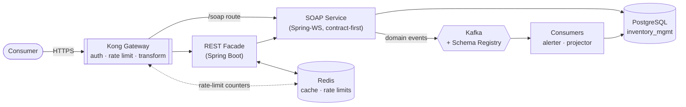

# Integration & API Platform — Learning Roadmap

**Goal:** build one coherent system that demonstrates SOAP services, XML schemas,
service contracts, Redis, an API gateway (Kong), and Kafka — the stack of an
enterprise integration / API modernization role.

**Domain:** the inventory system whose database you already built in
`Databases-and-Data-Platforms/Centralized Inventory Management System`. Reusing
it means every hour here goes into integration skills rather than re-inventing a
business domain.

---

## Why one project instead of six

These six technologies are not a random list — they are the standard toolkit for
dragging legacy SOAP services into a REST and event-driven world. Six small repos
each demonstrating one technology reads as tutorial-following. One system where a
SOAP service is fronted by a gateway, cached in Redis, and emits Kafka events
reads as *"this person can modernize an integration layer."*

Each phase below is independently runnable and committable, so you still get the
quick wins of separate projects without losing the narrative.

---

## The target architecture

---

## Phase 1 — Contract-first SOAP ✅ *scaffolded*

**Directory:** `phase1-soap-service/`
**Skills:** SOAP, XML schemas (XSD), service contracts

The XSD is hand-written first; JAXB generates the Java classes and Spring-WS
generates the WSDL. You never hand-edit generated code, and you never check in a
WSDL. That one-way dependency *is* contract-first.

| Concept | Where it lives |
|---|---|
| `xs:simpleType` + `xs:restriction` | `SkuType`, `WarehouseCodeType` |
| `xs:pattern` (regex validation) | SKU format `[A-Z]{3,4}-...` |
| `xs:enumeration` (closed value set) | `MovementTypeType` |
| `minOccurs` / `maxOccurs` | optional `warehouseCode`, repeated `stockLevel` |
| Boundary validation | `PayloadValidatingInterceptor` |
| Structured faults | `InventoryError` in the XSD + `InventoryErrorResolver` |
| WSDL generation | `DefaultWsdl11Definition` |

**Verified working:** WSDL generates 4 operations; invalid SKUs, unknown movement
types, and negative quantities are all rejected with SOAP Client faults before
any Java code runs.

### Exercises to finish Phase 1
1. **Break the contract on purpose.** Add `'DAMAGED'` to `MovementTypeType`,
   rebuild, and note that old consumers still work (additive change to a *response*
   type is safe; to a *request* enum it is not). Write down why.
2. **Version it.** Copy the XSD to `inventory-v2.xsd` with namespace
   `.../inventory/v2`, add a field, and register a second WSDL bean. Run both
   versions side by side — this is how real services migrate consumers.
3. **Write a contract test.** Assert the generated WSDL contains all 4 operations,
   so a careless XSD edit fails the build instead of breaking consumers silently.
4. **Consume your own service.** Use `WebServiceTemplate` to call it from a test.

---

## Phase 2 — REST facade + Redis

**Directory:** `phase2-rest-facade/`
**Skills:** Redis, API design, the strangler-fig migration pattern

A Spring Boot REST API that calls the SOAP service via `WebServiceTemplate`. This
is the *strangler fig*: new consumers get clean REST while the SOAP contract keeps
serving existing ones. Nobody rewrites anything.

**Build:**
- `GET /api/v1/products/{sku}` → calls `GetProduct` over SOAP
- `GET /api/v1/stock/{sku}` → calls `GetStockLevel`
- `POST /api/v1/movements` → calls `RecordStockMovement`
- An **OpenAPI 3** spec written **first**, by hand — the same contract-first
  discipline as Phase 1, so you can compare WSDL vs OpenAPI directly

**Redis work:**
| Pattern | Redis feature |
|---|---|
| Cache-aside on product lookups, TTL 60s | `STRING` + `SETEX` |
| Invalidate on write | `DEL` in the movement handler |
| Rate limiter (token bucket) | Lua script for atomicity |
| Idempotency keys on POST | `SET NX` with TTL |
| Recent-movements feed | `ZSET` scored by timestamp |

**The lesson that matters:** cache invalidation. Record a movement and the cached
stock level is instantly wrong. Fix it, then reason about why TTL alone is not
enough — and why "cache invalidation" is a running joke among engineers.

---

## Phase 3 — Kong API Gateway

**Directory:** `phase3-gateway/`
**Skills:** Kong, API management, the gateway pattern

Kong in DB-less declarative mode via Docker Compose. Everything is one
version-controlled `kong.yml` — no clicking around an admin UI.

**Configure:**
- **Routes:** `/api/*` → REST facade, `/soap/*` → SOAP service
- **key-auth** and **jwt** plugins — consumers, credentials, scopes
- **rate-limiting** backed by **the same Redis from Phase 2** (this is the tie-in:
  distributed rate limiting needs shared state)
- **request-transformer / response-transformer** — inject headers, strip internals
- **correlation-id** — one trace ID across gateway → REST → SOAP → DB
- **prometheus** — scrape metrics

**Exercises:**
1. Add a consumer, issue an API key, prove requests without it get 401.
2. Set rate-limit to 5/minute, hit it 10 times, watch 429s and the
   `X-RateLimit-Remaining` header.
3. Take the REST facade down and observe Kong's behavior. Add a health check and
   a fallback. This is where "gateway" stops being a proxy and starts being
   resilience infrastructure.

**If you later target an Apigee or MuleSoft role:** build a small satellite repo
for it. Apigee policies are XML (your XSD work transfers directly); MuleSoft's
differentiator is DataWeave. Do not try to learn all three at once — Kong teaches
the *concepts*, and the concepts are what transfer.

---

## Phase 4 — Kafka + Schema Registry

**Directory:** `phase4-events/`
**Skills:** Kafka, event-driven architecture, schema evolution

The SOAP service publishes a domain event whenever a movement is recorded. This is
where "service contracts" reappear in a new form: an Avro schema in the Schema
Registry is a contract between producer and consumer, exactly as the XSD is
between client and service.

**Topics:**
- `inventory.stock-movement.v1` — every recorded movement
- `inventory.stock-level-changed.v1` — resulting balance
- `inventory.reorder-needed.v1` — emitted when stock crosses the reorder point

**Consumers:**
- **Low-stock alerter** — consumes reorder events, logs/notifies
- **Read-model projector** — maintains a denormalized view for fast queries

**The schema-evolution exercise (do not skip this):**
1. Register `StockMovement` v1 in the Schema Registry.
2. Add an optional field with a default → **BACKWARD compatible**, old consumers fine.
3. Add a *required* field → registry **rejects** it under BACKWARD compatibility.
4. Compare directly to Phase 1: adding a required element to an XSD breaks
   consumers in exactly the same way, but XSD has no registry to stop you.
   **That contrast is the single most interview-ready insight in this project.**

**Stretch:** Debezium CDC from Postgres → Kafka using the outbox pattern, so events
are produced transactionally with the database write. Genuinely senior-level.

---

## Phase 5 — MCP server & LangGraph agent ✅ *built*

**Directory:** `phase5-mcp-agent/`
**Skills:** MCP (Model Context Protocol), LangGraph, Azure OpenAI, agent safety

The fourth contract in this repo, and the first one whose consumer is not a
program someone wrote. An MCP server publishes the platform as tools; a
LangGraph agent consumes it; so does Claude Code, over the same stdio transport.

| Concept | Where it lives |
|---|---|
| Tool schemas as a contract | `inventory_mcp/server.py` docstrings + type hints |
| Tool annotations (`readOnlyHint`, `destructiveHint`) | the `@mcp.tool` decorators |
| MCP resources | `inventory://contract/openapi` serves the Phase 2 spec itself |
| MCP prompts | `investigate_low_stock`, `restock_plan` |
| Both transports | stdio for desktop clients, streamable HTTP on `:8084` |
| Human-in-the-loop | `HumanInTheLoopMiddleware`, only on the write |
| Call budget | `ToolCallLimitMiddleware` at 15, below Kong's 20/min |
| Derived idempotency | `uuid5(session, sku, warehouse, type, qty)` |

**The lesson that matters:** an LLM is a non-deterministic consumer of a
deterministic contract. It retries, invents arguments, and calls the write
endpoint twice. Every guard built in Phases 1–3 for human-written clients held
it without modification — which is the argument for building the platform first
and the agent last, rather than the other way round.

**Exercises to go further**
1. **Make it misbehave on purpose.** Prompt the agent to record the same
   movement twice and confirm the second response says `replayed: true`.
2. **Take Redis down** while the agent runs. Reads still work; the rate limiter
   fails open. Compare with what the model *says* happened.
3. **Break the contract.** Remove `movementType` from the tool signature and
   watch the model confidently guess a value — then put it back and note that
   the XSD would have caught it either way.
4. **Add sampling.** MCP lets a server ask the client's model a question; use it
   to summarise a movement history server-side.

---

## Phase 6 — GraphQL facade ✅ *built*

**Directory:** `phase6-graphql/`
**Skills:** GraphQL, schema design, query cost analysis, DataLoader batching

A sibling of the REST facade over the same SOAP backend — and the phase that
audits the rest of the project by breaking it.

| Concept | Where it lives |
|---|---|
| SDL as contract | `src/main/resources/graphql/inventory.graphqls` |
| Closed value sets in the schema | `enum MovementType`, `enum WarehouseCode` |
| Deprecation instead of versioning | `suggestedOrderQty @deprecated` |
| N+1, measured | `BackendCallCounter` + `/diagnostics/backend-calls` |
| Batching | `@BatchMapping` on `LowStockItem.product` |
| Cost analysis | `QueryCostConfig` + `ListAwareComplexityCalculator` |
| Typed errors without HTTP status | `InventoryExceptionResolver` → `extensions.code` |

**The lesson that matters:** a gateway can only count requests. GraphQL makes
requests a meaningless unit of cost, so the limit has to move into the server and
change units — from requests per minute to complexity per query. Kong keeps auth,
coarse throttling and the correlation ID; it simply cannot do this one.

**Exercises to go further**
1. **Prove the limit is not theatre.** Set `GRAPHQL_MAX_COMPLEXITY` high, run the
   deep query, and read `/diagnostics/backend-calls`. Then put it back.
2. **Break batching on purpose.** Turn `@BatchMapping` into `@SchemaMapping` and
   watch the call count for a list with repeated SKUs.
3. **Add field-usage telemetry** so `@deprecated` means something. A deprecated
   field nobody measures is a field with an apology attached.
4. **Add persisted queries** — clients send a hash instead of a document, which
   hands the cost question back to the server and lets a gateway cache again.

---

## Suggested pace

| Phase | Effort | Ship when |
|---|---|---|
| 1 — SOAP/XSD | 1–2 weeks | WSDL published, validation rejects bad input, faults structured |
| 2 — REST + Redis | 1–2 weeks | Cache hit-rate visible, rate limiter works, invalidation correct |
| 3 — Kong | 1 week | Auth + rate limiting + correlation IDs through the whole chain |
| 4 — Kafka | 2–3 weeks | Events flowing, consumers running, schema evolution demonstrated |
| 5 — MCP + agent | 1–2 weeks | Tools callable from Claude Code, write gated by approval |
| 6 — GraphQL | 1–2 weeks | N+1 measured, an over-budget query refused at zero cost |

Commit at the end of each phase with a README showing how to run it. A reviewer
should be able to `docker compose up` and hit a working endpoint in under five
minutes — that alone puts the repo ahead of most.

---

## What to write in the top-level README when you're done

Recruiters and interviewers skim. Lead with the architecture diagram, then one
paragraph per phase answering: *what problem does this solve, and what did you
learn that you didn't know before?* The Phase 4 schema-evolution contrast and the
Phase 2 cache-invalidation bug are the two most compelling things here — they show
you hit real problems rather than following a tutorial.
